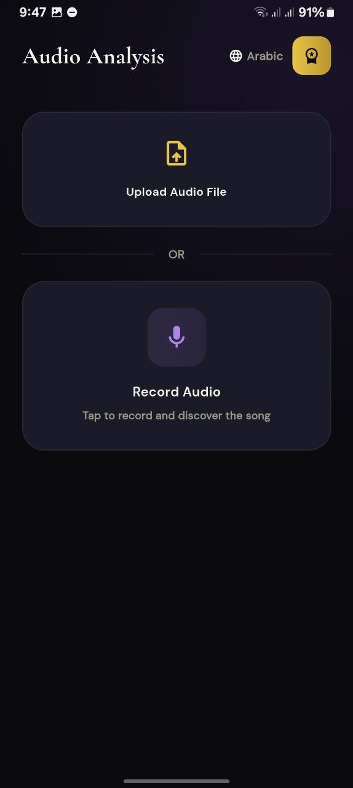
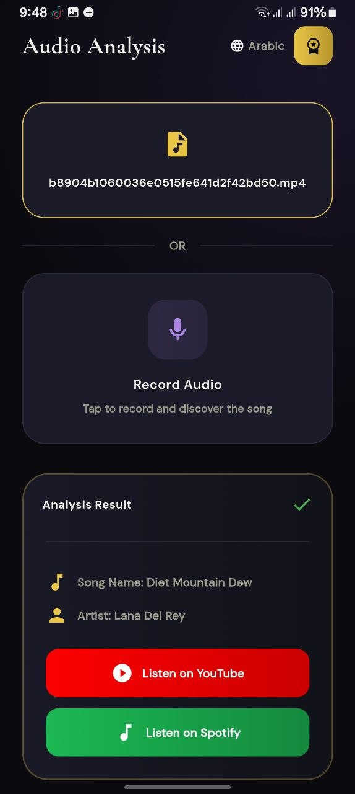

# Sonixy – AI Audio Analysis App

Sonixy is a modern mobile application that leverages Artificial Intelligence to analyze and process audio in a smart and efficient way.  
The app transforms sound into meaningful insights through real-time processing and intelligent analysis.

---

## Features

- Real-time audio processing
- AI-powered sound analysis
- Audio classification and insights
- Clean and user-friendly interface
- Fast and optimized performance
- Smart interpretation of audio data

---

## Tech Stack

- Flutter (Mobile Development)
- Dart
- AI Integration (Audio Analysis Models / APIs)
- State Management (Bloc / Cubit )

---

## UI Preview

### Home Screen

### Audio Analysis Screen

### onboarding Screen

---

## Project Structure

---

## How to Run the Project

### 1. Clone the repository

git clone https://github.com/your-username/sonixy.git

### 2. Navigate to the project directory

### 3. Install dependencies

### 4. Run the application

---

## Prerequisites

- Flutter SDK installed
- Dart SDK configured
- Android Studio or VS Code
- Android emulator or physical device

---

## Environment Setup

If the project uses environment variables:

### 1. Create a `.env` file in the root directory

### 2. Add required keys

Example:

API_KEY=your_api_key_here

### 3. Add `.env` to `.gitignore`

---

## Security Note

API keys and sensitive data are not included in this repository and are managed securely using environment variables.

---

## What I Learned

- Integrating AI with mobile applications
- Working with real-time audio processing
- Handling API integration in Flutter
- Improving UI/UX design
- Structuring scalable Flutter projects

---

## Future Improvements

- Improve AI model accuracy
- Add more audio analysis features
- Enhance UI animations
- Add cloud storage integration
- Support more audio formats

---

## Developer

Built as a Flutter AI-powered mobile application project focused on audio analysis and smart insights.
